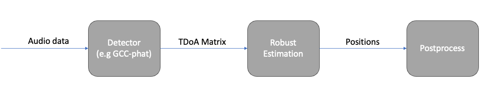

# Structure from Sound – python

## Setup
### Requirements
Install requirements with 

```
pip install -r requirements.txt
```

### Download Data
- Download data from [here](https://vision.maths.lth.se/erik_test/) and put the files in the `data` folder


### Using GUI-plot

In order to use `gui_plot.py` first run `genereate_detection_data.py` (takes ~10 min). Then run `gui_plot.py`

### Structure sketch


#### Data Formats

- Audio is stored as `.wav` files where each experiment is stored in a serperate folder with microphones i recording stored as `Track i.wav`
- TDoA-matrices (i.e. detections) are stored as `<experiment name>.npy` with the stored array being a tensor with shape `#detection_windows, #mics, #mics` where the value stored in position `(t,i,j)` is |s(t) - r_i| - |s(t) - r_j|
- Positions, to be decided...

