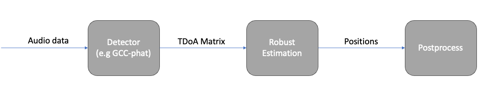

# Structure from Sound – python


## Setup

#### Prerequisites

To use this repo, you need to have MATLAB and Python installed.

#### Download Data
- Download data from [here](https://vision.maths.lth.se/erik_test/) and put the files in the `data` folder, 
```
├── data
│   ├── tdoa_20201016
│   │   ├── data
│   │   │   ├── chirp_0001
│   │   │   │   ├── Track 1.wav
│   │   │   │   ├── Track 2.wav
│   │   │   │   ├── ...
│   │   │   ├── music_0014
│   │   │   │   ├── Track 1.wav
│   │   │   │   ├── Track 2.wav
│   │   │   │   ├── ...
```

#### Matlab

Run `matlab/setup.m`

Copy `config.json.dist` and rename the copy `config.json`. Then edit `config.json` to include the path to your matlab installation.

#### Python

Install python dependencies using `pip3 install -r requirements.txt`


### Using GUI-plot

In order to use `gui_plot.py` first run `genereate_detection_data.py` (takes ~10 min). Then run `gui_plot.py`

### Structure sketch


#### Data Formats

- Audio is stored as `.wav` files where each experiment is stored in a serperate folder with microphones i recording stored as `Track i.wav`
- TDoA-matrices (i.e. detections) are stored as `<experiment name>.npy` with the stored array being a tensor with shape `#detection_windows, #mics, #mics` where the value stored in position `(t,i,j)` is |s(t) - r_i| - |s(t) - r_j| (units meters) (TODO: double check sign of this)
- Positions, to be decided...

